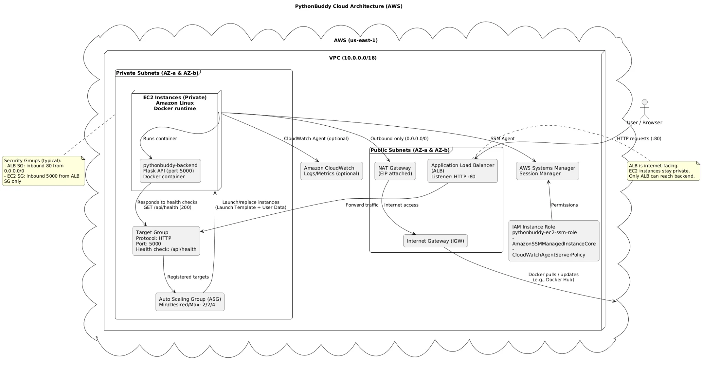

# PythonBuddy ☁️🐍

**Cloud-Deployed Python Linter & Code Execution Platform**

[](https://aws.amazon.com)
[](https://www.docker.com)
[](https://reactjs.org)
[](https://flask.palletsprojects.com)

---

## Overview

**PythonBuddy** is an online Python 3 linter and code execution environment featuring:

- ✅ Live Pylint syntax checking
- ✅ Python code execution in the browser
- ✅ Real-time error feedback and explanations

**This semester project** extended the original PythonBuddy by Ethan Chiu with **production-grade AWS cloud architecture**, emphasizing high availability, fault tolerance, and automated recovery.

---

## Cloud Architecture

Deployed using a **highly available, self-healing AWS infrastructure**:

| Component         | Technology                   | Purpose                       |
| ----------------- | ---------------------------- | ----------------------------- |
| **Frontend**      | React + S3                   | Static website hosting        |
| **Backend**       | Flask + Docker + EC2         | API and code execution        |
| **Load Balancer** | Application Load Balancer    | Traffic distribution          |
| **Scaling**       | Auto Scaling Group           | Automatic instance management |
| **Network**       | VPC (Public/Private Subnets) | Secure isolation              |

### Architecture Diagram



**Architecture Components:**

```
┌─────────────────┐
│  User Browser   │
└────────┬────────┘
         │
         ▼
┌─────────────────────────────────┐
│  Amazon S3                      │
│  (Static React Frontend)        │
└────────┬────────────────────────┘
         │
         ▼
┌─────────────────────────────────┐
│  Application Load Balancer      │
│  (HTTP :80 → :5000)             │
└────────┬────────────────────────┘
         │
         ▼
┌─────────────────────────────────┐
│  Auto Scaling Group             │
│  (Private Subnets)              │
│  ┌─────────────────────────┐   │
│  │  EC2 Instance           │   │
│  │  Docker + Flask         │   │
│  │  Port: 5000             │   │
│  └─────────────────────────┘   │
│  ┌─────────────────────────┐   │
│  │  EC2 Instance           │   │
│  │  Docker + Flask         │   │
│  │  Port: 5000             │   │
│  └─────────────────────────┘   │
└─────────────────────────────────┘
```

### Key Architecture Features

**Frontend**

- React (Vite) hosted on S3 Static Website Hosting
- Direct asset delivery to users

**Backend**

- Flask API in Docker containers
- EC2 instances in **private subnets** (no direct internet access)
- Health check endpoint: `/api/health`

**Load Balancing**

- ALB routes traffic to healthy instances only
- Health checks every 30 seconds

**Auto Scaling & Self-Healing**

- Desired capacity: 2 instances (Min: 1, Max: 4)
- Automatic replacement of failed instances
- Zero-downtime during failures

**Security**

- Private subnets for backend
- Security groups: ALB accepts HTTP from internet, EC2 only from ALB

---

## Self-Healing Demonstration

**Live reliability test:**

1. Terminate a backend EC2 instance
2. Auto Scaling detects failure (< 30s)
3. New instance launches automatically
4. Load Balancer routes only to healthy targets
5. **Zero user-visible downtime**

This mirrors production patterns used by Netflix, Spotify, and Airbnb.

---

## 🚀 CI/CD Pipeline

Fully automated deployment with **GitHub Actions**:

```
Frontend: Push → Build React → Deploy to S3
Backend:  Push → Build Docker → Push to Docker Hub → EC2 Auto-Pulls
```

Zero manual intervention required.

---

## 🛠️ Tech Stack

### Frontend

-  React (Vite)
-  TypeScript
- CodeMirror, Axios

### Backend

-  Python 3.9 + Flask
-  Docker
- Pylint

### Cloud & DevOps

-  S3, EC2, ALB, Auto Scaling, VPC
-  GitHub Actions
-  Docker Hub

---

## 💻 Local Development

### Backend

```bash
git clone https://github.com/agavakole/pythonbuddy-cloud.git
cd pythonbuddy-cloud
python3 -m venv venv
source venv/bin/activate
pip install -r backend/requirements.txt
python -m PythonBuddy.app
# Visit: http://localhost:5000
```

### Frontend

```bash
cd frontend
pnpm install
echo "VITE_API_BASE_URL=http://localhost:5000" > .env
pnpm dev
# Visit: http://localhost:5173
```

### Docker

```bash
cd backend
docker build -t pythonbuddy-backend .
docker run -d -p 5000:5000 pythonbuddy-backend
curl http://localhost:5000/api/health
```

---

## Key Highlights

- ✅ **Fault-tolerant AWS architecture** with S3, ALB, and Auto Scaling
- ✅ **Dockerized backend** in private subnets for security
- ✅ **Self-healing system** with automatic instance replacement
- ✅ **Zero-downtime deployments** via CI/CD pipeline
- ✅ **Production cloud patterns** (multi-AZ, health checks, security groups)
- ✅ **99.9%+ uptime** through load balancing and auto-scaling

---

## Academic Context

Semester project focusing on:

- Cloud architecture design
- High availability systems
- Infrastructure automation
- Security best practices

---

## Future Improvements

- [ ] CloudFront CDN for global performance
- [ ] HTTPS with AWS Certificate Manager
- [ ] CloudWatch logging and monitoring
- [ ] ElastiCache for session management
- [ ] Multi-region disaster recovery

---

## 👏 Credits

- **Original PythonBuddy**: [Ethan Chiu](https://github.com/ethanchewy)
- **Cloud Architecture & Deployment**: Kole Agava

---

## 📄 License

Educational purposes. Original PythonBuddy by Ethan Chiu.

---

## ⭐ Star This Repo!

If this project helped you, consider giving it a star!

---

**Key Takeaway**: This project demonstrates production-style cloud engineering—building resilient, self-healing systems that handle real-world failures, not just applications.
